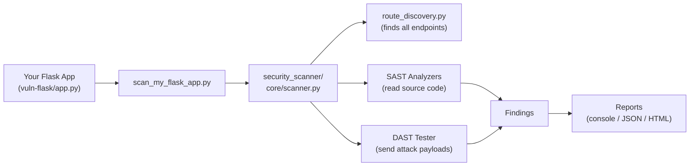

# Python Security Scanner — Complete Project Guide

## Full Project Tree

```
python_security_scanner_library_project/
│
├── security_scanner/          ← THE LIBRARY (core code)
│   ├── __init__.py
│   ├── core/                  ← Engine
│   │   ├── scanner.py
│   │   └── route_discovery.py
│   ├── analyzers/             ← SAST (static analysis)
│   │   ├── base.py
│   │   ├── sql_injection.py
│   │   ├── xss.py
│   │   ├── secrets.py
│   │   └── config.py
│   ├── dynamic/               ← DAST (runtime testing)
│   │   ├── payload_tester.py
│   │   ├── response_analyzer.py
│   │   └── payloads/
│   │       ├── sqli_payloads.txt
│   │       └── xss_payloads.txt
│   ├── models/                ← Data structures
│   │   ├── finding.py
│   │   └── scan_result.py
│   └── reporting/             ← Output reports
│       ├── console.py
│       ├── json_report.py
│       └── html_report.py
│
├── examples/                  ← Sample apps for testing
│   ├── vulnerable_flask_app.py
│   ├── safe_flask_app.py
│   ├── vulnerable_django_app.py
│   └── safe_django_app.py
│
├── tests/                     ← Unit & integration tests
│   ├── conftest.py
│   ├── test_scanner.py
│   ├── test_sql_injection.py
│   ├── test_xss.py
│   ├── test_secrets.py
│   ├── test_config.py
│   ├── test_dast.py
│   ├── test_reporting.py
│   └── test_evaluation.py
│
├── vuln-flask/                ← YOUR custom Flask app to scan
│   ├── app.py
│   ├── init_db.py
│   └── templates/
│
├── run_flask_scan.py                ← Scan the built-in example Flask app
├── run_django_scan.py         ← Scan the built-in example Django app
├── scan_my_flask_app.py             ← Scan YOUR vuln-flask app
├── evaluate_flask.py                ← Measure scanner accuracy (Flask)
├── evaluate_django.py         ← Measure scanner accuracy (Django)
├── run_test_suite.py          ← Run all pytest tests
├── setup_test_db.py           ← Create test SQLite database
├── pyproject.toml             ← Project metadata & dependencies
└── *.html / *.json            ← Generated scan reports
```

---

## 🔧 The Library — `security_scanner/`

This is the **core scanner library**. Everything else just *uses* it.

### [security_scanner/__init__.py](file:///c:/Users/prana/Downloads/python_security_scanner_library_project/security_scanner/__init__.py)
**Role:** Package entry point. Lets you do `from security_scanner import scan_app`.

---

### `core/` — The Engine

| File | What it does |
|------|-------------|
| **[scanner.py](file:///c:/Users/prana/Downloads/python_security_scanner_library_project/tests/test_scanner.py)** | The **main entry point** — `scan_app(app, dynamic=True)`. Orchestrates the entire scan: discovers routes → runs SAST analyzers → optionally runs DAST → collects all findings into a `ScanResult`. |
| **[route_discovery.py](file:///c:/Users/prana/Downloads/python_security_scanner_library_project/security_scanner/core/route_discovery.py)** | Inspects a Flask/Django app object and **extracts all routes** (URLs, HTTP methods, view functions, source file paths). This is how the scanner knows what endpoints to analyze. |

---

### `analyzers/` — SAST (Static Analysis)

These read your **source code** without running the app. They look for vulnerable patterns.

| File | What it detects |
|------|----------------|
| **[base.py](file:///c:/Users/prana/Downloads/python_security_scanner_library_project/security_scanner/analyzers/base.py)** | Base class for all analyzers. Defines the common interface (`analyze()` method). |
| **[sql_injection.py](file:///c:/Users/prana/Downloads/python_security_scanner_library_project/tests/test_sql_injection.py)** | Finds SQL injection: f-strings with SQL, string concatenation in queries, `cursor.execute()` with unsanitized input. |
| **[xss.py](file:///c:/Users/prana/Downloads/python_security_scanner_library_project/tests/test_xss.py)** | Finds Cross-Site Scripting: `render_template_string()` with user input, f-strings returning HTML, `|safe` in templates. |
| **[secrets.py](file:///c:/Users/prana/Downloads/python_security_scanner_library_project/tests/test_secrets.py)** | Finds hardcoded secrets: weak `secret_key`, API tokens, passwords in source code. |
| **[config.py](file:///c:/Users/prana/Downloads/python_security_scanner_library_project/tests/test_config.py)** | Finds config issues: `debug=True`, missing CSRF protection, insecure cookie settings, missing security headers. |

---

### `dynamic/` — DAST (Dynamic Testing)

These **actually run your app** in a test server and send attack payloads to it.

| File | What it does |
|------|-------------|
| **[payload_tester.py](file:///c:/Users/prana/Downloads/python_security_scanner_library_project/security_scanner/dynamic/payload_tester.py)** | Spins up your Flask/Django app on a local test server, then sends real HTTP requests with malicious payloads (SQL injection strings, XSS scripts) to every discovered endpoint. |
| **[response_analyzer.py](file:///c:/Users/prana/Downloads/python_security_scanner_library_project/security_scanner/dynamic/response_analyzer.py)** | Analyzes the HTTP responses from DAST. Checks if the payload was reflected back (XSS), if SQL errors appeared (SQLi), etc. |
| **[payloads/sqli_payloads.txt](file:///c:/Users/prana/Downloads/python_security_scanner_library_project/security_scanner/dynamic/payloads/sqli_payloads.txt)** | List of SQL injection attack strings (e.g., `' OR 1=1 --`, `'; DROP TABLE users--`). |
| **[payloads/xss_payloads.txt](file:///c:/Users/prana/Downloads/python_security_scanner_library_project/security_scanner/dynamic/payloads/xss_payloads.txt)** | List of XSS attack strings (e.g., `<script>alert(1)</script>`). |

---

### `models/` — Data Structures

| File | What it defines |
|------|----------------|
| **[finding.py](file:///c:/Users/prana/Downloads/python_security_scanner_library_project/security_scanner/models/finding.py)** | [Finding](file:///c:/Users/prana/Downloads/python_security_scanner_library_project/security_scanner/models/finding.py#27-42) dataclass — one single vulnerability found. Has fields: `vuln_type`, `severity`, `endpoint`, [file](file:///c:/Users/prana/Downloads/python_security_scanner_library_project/examples/vulnerable_flask_app.py#36-42), `line`, `code_snippet`, `explanation`, `fix_recommendation`, etc. Also defines [Severity](file:///c:/Users/prana/Downloads/python_security_scanner_library_project/security_scanner/models/finding.py#7-13) enum (CRITICAL/HIGH/MEDIUM/LOW/INFO) and [VulnerabilityType](file:///c:/Users/prana/Downloads/python_security_scanner_library_project/security_scanner/models/finding.py#15-25) enum (SQL_INJECTION/XSS/etc). |
| **[scan_result.py](file:///c:/Users/prana/Downloads/python_security_scanner_library_project/security_scanner/models/scan_result.py)** | `ScanResult` dataclass — the complete result of a scan. Contains `app_name`, `findings` (list of [Finding](file:///c:/Users/prana/Downloads/python_security_scanner_library_project/security_scanner/models/finding.py#27-42)), `routes_scanned`, `scan_duration_seconds`, and a `summary()` method. |

---

### `reporting/` — Output Reports

| File | What it generates |
|------|------------------|
| **[console.py](file:///c:/Users/prana/Downloads/python_security_scanner_library_project/security_scanner/reporting/console.py)** | Prints a **colored terminal report** — sorted by severity, with icons, code snippets, fix suggestions. |
| **[json_report.py](file:///c:/Users/prana/Downloads/python_security_scanner_library_project/security_scanner/reporting/json_report.py)** | Generates a **JSON file** with all findings — machine-readable, good for CI/CD pipelines. |
| **[html_report.py](file:///c:/Users/prana/Downloads/python_security_scanner_library_project/security_scanner/reporting/html_report.py)** | Generates a **styled HTML report** — visual, shareable, with severity badges and expandable sections. |

---

## 🧪 Test Apps — `examples/`

These are **pre-built sample apps** used by the scanner's own tests and evaluation scripts.

| File | Purpose |
|------|---------|
| **[vulnerable_flask_app.py](file:///c:/Users/prana/Downloads/python_security_scanner_library_project/examples/vulnerable_flask_app.py)** | A Flask app with **intentional vulnerabilities** (SQLi, XSS, hardcoded secrets, debug mode). Used to test the scanner finds real bugs. |
| **[safe_flask_app.py](file:///c:/Users/prana/Downloads/python_security_scanner_library_project/examples/safe_flask_app.py)** | A Flask app with **no vulnerabilities** (parameterized queries, proper escaping). Used to test the scanner doesn't give false positives. |
| **[vulnerable_django_app.py](file:///c:/Users/prana/Downloads/python_security_scanner_library_project/examples/vulnerable_django_app.py)** | Same concept, but for Django. |
| **[safe_django_app.py](file:///c:/Users/prana/Downloads/python_security_scanner_library_project/examples/safe_django_app.py)** | Safe Django app for false-positive testing. |

---

## 🚀 Run Scripts — Project Root

These are **standalone scripts** you run from the terminal.

| File | Command | What it does |
|------|---------|-------------|
| **[run_flask_scan.py](file:///c:/Users/prana/Downloads/python_security_scanner_library_project/run_flask_scan.py)** | `python run_flask_scan.py` | Scans the built-in [vulnerable_flask_app.py](file:///c:/Users/prana/Downloads/python_security_scanner_library_project/examples/vulnerable_flask_app.py) and generates console + JSON + HTML reports. |
| **[run_django_scan.py](file:///c:/Users/prana/Downloads/python_security_scanner_library_project/run_django_scan.py)** | `python run_django_scan.py` | Same but for the Django example app. |
| **[scan_my_flask_app.py](file:///c:/Users/prana/Downloads/python_security_scanner_library_project/scan_my_flask_app.py)** | `python scan_my_flask_app.py` | Scans **YOUR** [vuln-flask/app.py](file:///c:/Users/prana/Downloads/python_security_scanner_library_project/vuln-flask/app.py) and generates reports. |
| **[evaluate_flask.py](file:///c:/Users/prana/Downloads/python_security_scanner_library_project/evaluate_flask.py)** | `python evaluate_flask.py` | Measures scanner **accuracy** against the Flask examples — calculates precision, recall, F1 score, confusion matrix. |
| **[evaluate_django.py](file:///c:/Users/prana/Downloads/python_security_scanner_library_project/evaluate_django.py)** | `python evaluate_django.py` | Same accuracy evaluation but for Django. |
| **[run_test_suite.py](file:///c:/Users/prana/Downloads/python_security_scanner_library_project/run_test_suite.py)** | `python run_test_suite.py` | Runs all pytest tests and prints a summary. |
| **[setup_test_db.py](file:///c:/Users/prana/Downloads/python_security_scanner_library_project/setup_test_db.py)** | `python setup_test_db.py` | Creates a [test.db](file:///c:/Users/prana/Downloads/python_security_scanner_library_project/test.db) SQLite database with sample users table (needed for DAST tests). |

---

## 📁 Your App — `vuln-flask/`

| File | Purpose |
|------|---------|
| **[app.py](file:///c:/Users/prana/Downloads/python_security_scanner_library_project/scan_my_flask_app.py)** | Your intentionally vulnerable Flask app with SQL injection, XSS, weak secrets, and debug mode. |
| **[init_db.py](file:///c:/Users/prana/Downloads/python_security_scanner_library_project/vuln-flask/init_db.py)** | Creates the [vuln.db](file:///c:/Users/prana/Downloads/python_security_scanner_library_project/vuln.db) SQLite database for your app. |
| **`templates/`** | HTML templates (login, dashboard, search, comments pages). |

---

## 📦 Config & Generated Files

| File | Purpose |
|------|---------|
| **[pyproject.toml](file:///c:/Users/prana/Downloads/python_security_scanner_library_project/pyproject.toml)** | Project metadata — name, version, Python version, dependencies (flask, django, etc). |
| **[.gitignore](file:///c:/Users/prana/Downloads/python_security_scanner_library_project/.gitignore)** | Tells Git which files to ignore (`__pycache__`, [.db](file:///c:/Users/prana/Downloads/python_security_scanner_library_project/vuln.db) files, etc). |
| **`*.html` / `*.json`** | Generated scan reports from previous runs. |
| **[test.db](file:///c:/Users/prana/Downloads/python_security_scanner_library_project/test.db) / [vuln.db](file:///c:/Users/prana/Downloads/python_security_scanner_library_project/vuln.db)** | SQLite databases used during scanning. |

---

## How It All Fits Together



> **In short:** [scan_my_flask_app.py](file:///c:/Users/prana/Downloads/python_security_scanner_library_project/scan_my_flask_app.py) imports your Flask app → passes it to `scan_app()` → the scanner discovers routes, runs SAST + DAST → collects findings → generates reports.
